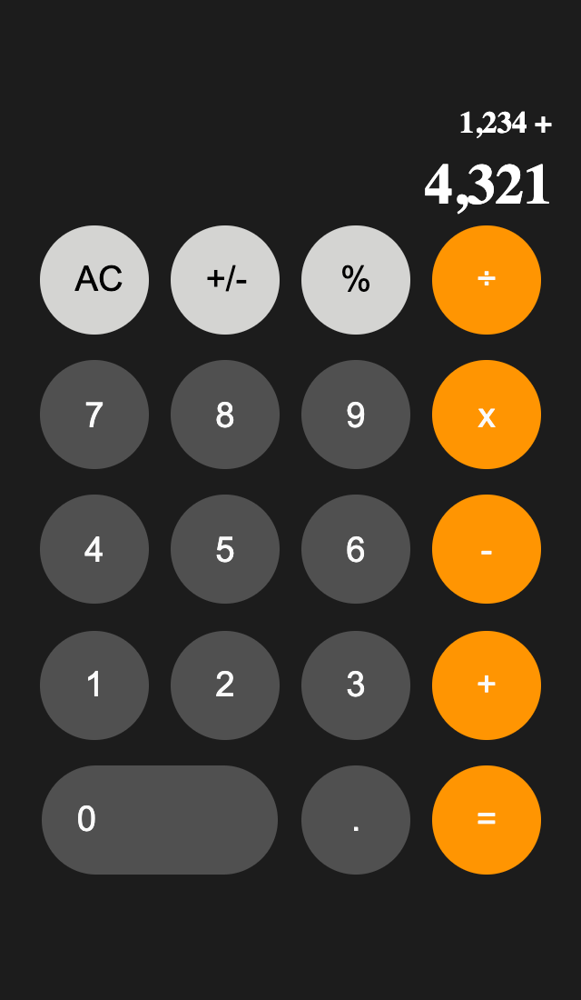
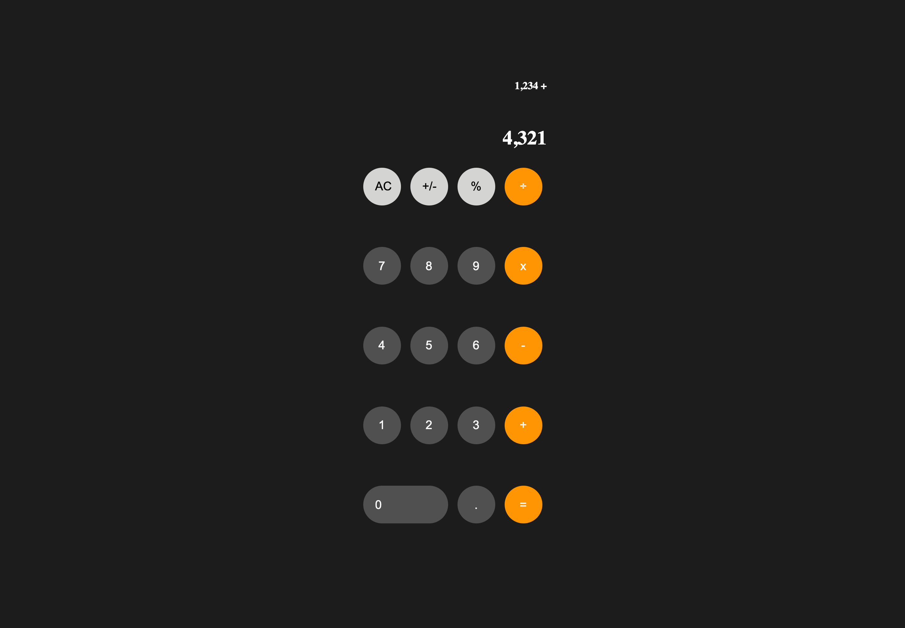

# Javascript iPhone calculator

This self challenge was encouraged by this [YouTube video](https://youtu.be/j59qQ7YWLxw) where I developed some of my Javascript skills. However the design was replicated without any help (except for the buttons were oval, which was resolved by giving them a height and width of the same value).

## Table of contents

- [Overview](#overview)
  - [The challenge](#the-challenge)
  - [Screenshot](#screenshot)
  - [Links](#links)
- [My process](#my-process)
  - [Built with](#built-with)
  - [What I learned](#what-i-learned)
    - [key consepts](##key-consepts)
- [Continued development](##continued-development)
 
## Overview

### Screenshot




### Links

- Live Site URL: [view site](https://smarko-web.github.io/iphone-calculator/)

## My process

### Built with

- Semantic HTML5 markup
- CSS custom properties
- CSS grid
- Flexbox
- Mobile-first workflow

### What I learned

Use this section to recap over some of your major learnings while working through this project. Writing these out and providing code samples of areas you want to highlight is a great way to reinforce your own knowledge.

To see how you can add code snippets, see below:

```html
<script type="module" src="script.js"></script>

```
```js
export default calculator;
export const prevNumber = document.querySelector('[data-previous]');
export const currentNumber = document.querySelector('[data-current]');
import Calculator from '/calculator.js';

this.prevNumber = this.currentNumber + ' ' + this.operation.toString();
// I added the catcading in the appendOperation method (self idea), but later updateDisplay method (followed the tutorial)

 clearButton.addEventListener('click', () => {
            calculator.clear();
            calculator.updateDisplay();
            //make the AC button visible again
            clearButton.classList.add('hide');
            clearAllButton.classList.remove('hide');
});
```

### key concepts
- use px for grid gap to not have grid overflow(if use % you will incounter problems)

- [active vs focus pseudo classes](https://www.youtube.com/watch?v=H1-rmg1Fj3E) - active is when you click & hold on an elemet, focus is when you clicked on an element (use with tab)

- [JavaScript ES6 Modules](https://www.youtube.com/watch?v=cRHQNNcYf6s) - learned how to export/import using JS Modules (however I couldn’t implement it in this project because GitHub pages doesn’t support them)

## Continued development

I would like to become more proficient in my HTML, JS and CSS skills before I start doing more advanced web development. As I am practicing these skills, applying the prior knowledge that I have grained from YouTube and other Self paced courses, increasing confidence in web design/development.